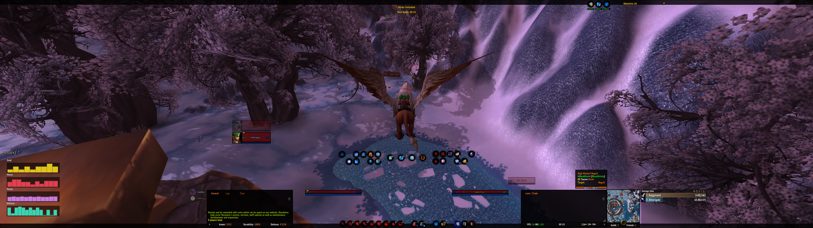
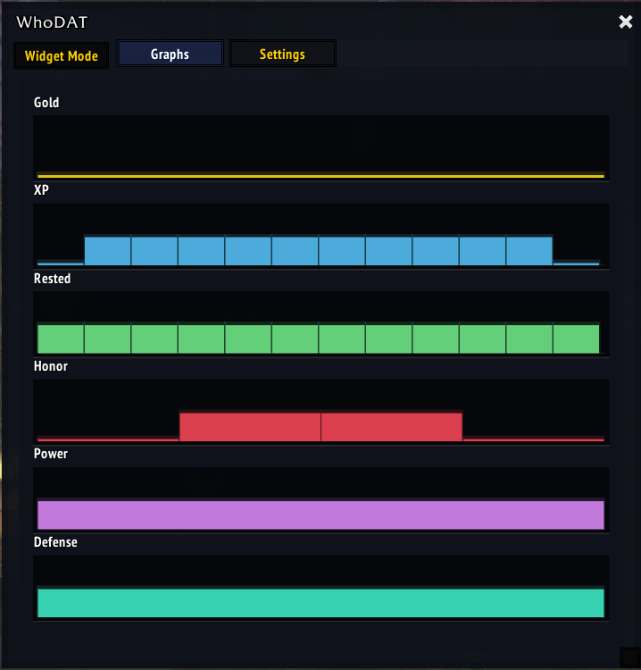
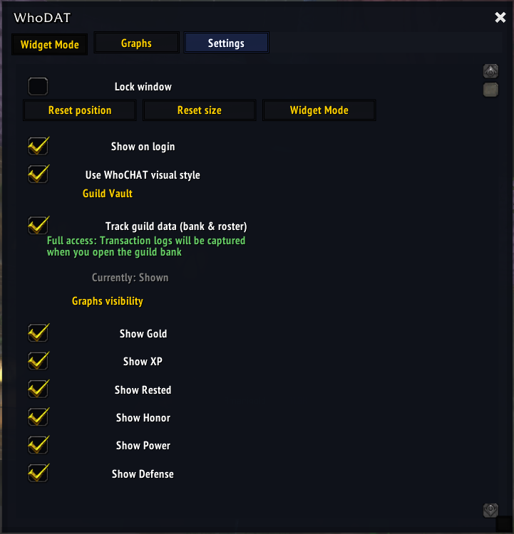
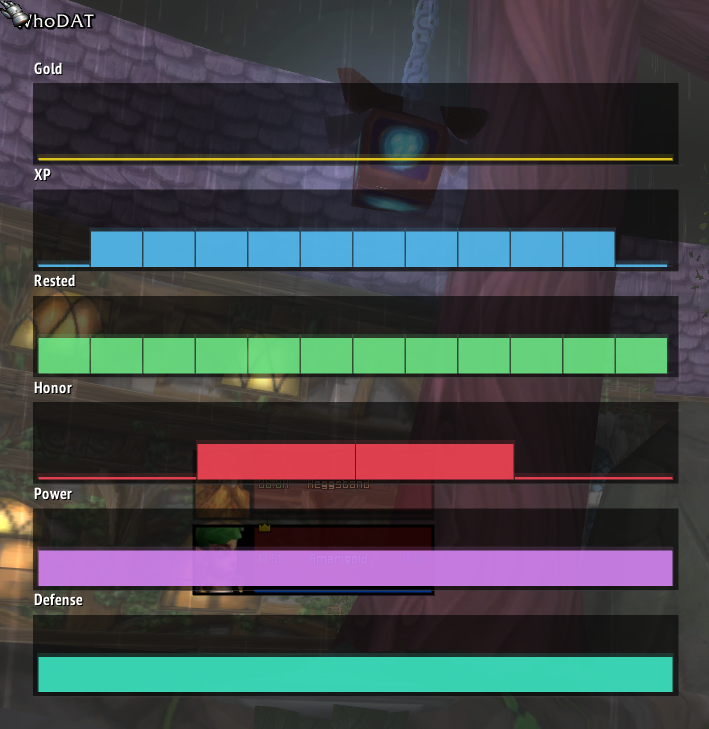

# WhoDAT

<div align="center">

### 📊 Comprehensive Character Analytics for WoW 3.3.5a (Wrath of the Lich King)

*Track everything. Visualize anything. Own your data.*

[](https://github.com/Xanthey/WhoDAT)
[](https://wowpedia.fandom.com/wiki/Patch_3.3.5)
[](LICENSE)

[Features](#-features) • [Installation](#-installation) • [Usage](#-usage) • [Data Export](#-data-export) • [WhoDASH](#-whodash-dashboard)

</div>
<p align="center">
  
</p>
---

## 🎯 What is WhoDAT?

**WhoDAT** (Who's Doing All This?) is a World of Warcraft addon that captures **every meaningful event** in your character's journey. From gold fluctuations and quest completions to combat statistics and auction house activity, WhoDAT provides a comprehensive, event-sourced data layer for your WoW experience.

Unlike traditional addons that only show current state, WhoDAT maintains **complete historical records** of your character's progression, enabling powerful analytics through the companion [WhoDASH](#-whodash-dashboard) web dashboard.
<table border="0" cellpadding="0" cellspacing="0">
  <tr>
    <td align="center" valign="top"><b>Graphs</b><br></td>
    <td align="center" valign="top"><b>Settings</b><br></td>
    <td align="center" valign="top"><b>Widget Mode</b><br></td>
  </tr>
</table>
---

## ✨ Features

### 📊 **Stats & Progression Tracking**
- **Real-time monitoring** of experience, rested XP, and level progression
- **Combat statistics** including power, defense, armor, attack power, spell power
- **Character attributes** with full stat breakdowns (Stamina, Strength, Agility, Intellect, Spirit)
- **Resistances** across all schools of magic
- **Talent tracking** with snapshot support
- **Guild membership** and progression

### 💰 **Economy & Wealth**
- **Gold tracking** with session-based trend analysis
- **Money flow** from looting, questing, vendoring, and auction house
- **Per-character** and **account-wide** wealth aggregation
- **Historical snapshots** to track economic decisions

### 🎯 **Quest & Achievement System**
- **Quest log monitoring** with progress tracking
- **Quest completion events** with reward details
- **Achievement unlocks** with timestamps
- **Quest chain visualization** ready data

### ⚔️ **Combat Analytics**
- **Death tracking** with killer information, location, and durability loss
- **Combat event logging** (damage dealt, healing, crowd control)
- **Buff/debuff snapshots** at combat start and end
- **Instance and raid** participation tracking

### 🏪 **Auction House Intelligence**
- **Market price tracking** with time-series data
- **Your auction outcomes** (posted, sold, expired, cancelled)
- **Historical market trends** for all items
- **Bidding and buyout** behavior analysis

### 📦 **Inventory Management**
- **Container snapshots** (bags, bank, keyring, mailbox)
- **Item lifecycle events** (obtained, equipped, sold, destroyed)
- **Equipment changes** with before/after states
- **Durability tracking** across all gear slots

### 🔒 **Instance Lockouts**
- **Raid and dungeon** lockout tracking
- **Boss kill** progression per instance
- **Reset timers** and extended lockout support

### 🌐 **Social Systems**
- **Friend list** changes
- **Ignore list** tracking
- **Guild roster** updates
- **Party and raid** composition logging

### 📈 **In-Game Visualizations**
- **Sparkline graphs** for gold, XP, rested, honor, power, and defense
- **Session-scoped data** (show only last N sessions)
- **Customizable graph visibility** and smoothing
- **Lightweight rendering** optimized for Wrath client

### 🎨 **Customizable UI**
- **Dual modes**: Full docked window or minimal floating widget
- **ElvUI integration** with automatic skinning support
- **Theme options**: WhoCHAT-style dark theme or classic WoW chrome
- **Drag-to-resize** and position saving
- **Tab-based navigation** for different data views

### 📤 **Data Export System**
- **Chunked export** for large datasets (prevents disconnects)
- **Metadata tracking** with hash-based change detection
- **Export progress UI** with cancel support
- **JSON output** optimized for WhoDASH import
- **Selective export** (only changed chunks)

---

## 🚀 Installation

### Method 1: Manual Installation
1. Download the latest release from [Releases](https://github.com/Xanthey/whodat/releases)
2. Extract the `WhoDAT` folder to your WoW addons directory:
   ```
   World of Warcraft/Interface/AddOns/WhoDAT/
   ```
3. Restart WoW

### Method 2: Git Clone (Development)
```bash
cd "World of Warcraft/Interface/AddOns/"
git clone https://github.com/Xanthey/whodat.git
```

---

## 💡 Usage

### Slash Commands

```
/whodat              - Toggle main window
/whodat show         - Show main window
/whodat hide         - Hide main window
/whodat widget       - Toggle widget overlay mode
/whodat export       - Export all data to JSON
/whodat export mini  - Export minimal dataset
/whodat reset        - Reset window position and size
/whodat lock         - Lock widget in place
/whodat unlock       - Unlock widget for repositioning
```

### First-Time Setup

1. **Launch WoW** and log in to your character
2. Type `/whodat` to open the main interface
3. **Explore the tabs**:
   - 📊 **Graphs** - View real-time progression charts
   - 🎯 **Stats** - Detailed character statistics
   - 💰 **Economy** - Gold and wealth tracking
   - 🏪 **Auction** - Market activity and history
   - ⚙️ **Config** - Customize behavior and appearance

4. **Configure graph visibility** in the Config tab to show only the metrics you care about

### Widget Mode

For a minimal, unobtrusive experience:

1. Type `/whodat widget` to enable widget mode
2. **Drag the title** to reposition
3. **Customize display** in Config → Widget Settings
4. Type `/whodat lock` when positioned

---

## 📊 Data Export

WhoDAT's export system generates **JSON files** containing your complete character data.

### Export Your Data

```
/reload the game, exit the game, or any other event that causes the game to refresh it's local data or:
/whodat export
```

This creates timestamped JSON files in your `WTF/Account/<Account>/Server/Character/SavedVariables/` directory.

### Export Format

```json
{
  "metadata": {
    "version": "3.0.0",
    "schema_version": 3,
    "export_format": "v3",
    "generated_at": 1704067200,
    "character": {
      "name": "YourName",
      "realm": "YourRealm",
      "class": "Warrior",
      "faction": "Alliance",
      "level": 80
    }
  },
  "chunks": {
    "identity": { /* Character identity */ },
    "series_money": { /* Gold over time */ },
    "series_xp": { /* Experience progression */ },
    "events_items": { /* Item lifecycle events */ },
    "events_quests": { /* Quest completions */ },
    "snapshots_equipment": { /* Gear changes */ },
    "catalogs_items": { /* Item database */ }
  }
}
```

### Chunked Export System

For large datasets, WhoDAT uses **chunked exports** to prevent disconnections:
- Each logical data domain is a separate chunk
- Chunks are hashed to detect changes
- Export only sends modified chunks
- Progress UI shows real-time status (rarely, when applicable)

---

## 🌐 WhoDASH Dashboard

**WhoDASH** is the companion web dashboard for visualizing WhoDAT data. Check out the [WhoDASH repository](https://github.com/Xanthey/whodash) for installation and usage instructions.

### Features
- 📈 **Interactive charts** for all tracked metrics
- 💰 **Wealth analytics** with income/expense breakdown
- 🎯 **Quest progression** timelines
- 🏪 **Auction house** market intelligence
- ⚔️ **Combat statistics** and death analysis
- 📊 **Multi-character** comparison views

### Using WhoDASH
1. Export your data with `/whodat export`
2. Navigate to the WhoDASH web interface
3. Upload your exported JSON file
4. Explore your data with interactive visualizations

> **Note**: WhoDASH repository and deployment instructions coming soon!

---

## 🏗️ Architecture

WhoDAT is built on a **modular, event-driven architecture**:

```
WhoDAT/
├── config.lua              # Feature flags, defaults, schema versioning
├── core.lua                # Event bus, initialization, slash commands
├── utils.lua               # Logging, throttling, color helpers
├── events.lua              # Global event routing
│
├── tracker_stats.lua       # Character stats & progression
├── tracker_containers.lua  # Bags, bank, keyring, mailbox
├── tracker_loot.lua        # Loot events and sources
├── tracker_quests.lua      # Quest log and completions
├── tracker_achievements.lua# Achievement unlocks
├── tracker_auction.lua     # Auction house activity
├── tracker_combat.lua      # Combat events and damage
├── tracker_deaths.lua      # Death tracking with context
├── tracker_social.lua      # Friends, guild, ignore lists
├── tracker_lockouts.lua    # Instance and raid lockouts
│
├── graphs.lua              # Sparkline visualization engine
├── ui_main.lua             # Main windowed interface
├── ui_widgetmode.lua       # Minimal overlay widget
├── widget_background_ui.lua# Widget theming
│
├── export.lua              # Data serialization
├── chunked_export.lua      # Large dataset handling
├── export_metadata.lua     # Hash-based change tracking
├── export_progress_ui.lua  # Export progress interface
│
└── memory_management.lua   # Performance optimization
```

### Key Design Principles
- ✅ **Event sourcing**: Append-only event logs
- ✅ **Snapshots**: Point-in-time state captures
- ✅ **Catalogs**: Normalized item/quest/achievement databases
- ✅ **Feature flags**: Toggle modules without code changes
- ✅ **Throttling**: Prevent performance issues
- ✅ **Idempotent initialization**: Safe across `/reload`

---

## ⚙️ Configuration

### Feature Flags

Enable or disable tracking modules in `config.lua`:

```lua
WhoDAT_Config.features = {
  items        = true,  -- Item lifecycle tracking
  inventory    = true,  -- Container snapshots
  stats        = true,  -- Character stats
  quests       = true,  -- Quest tracking
  auction      = true,  -- Auction house
  achievements = true,  -- Achievement tracking
  ui_main      = true,  -- Main interface
  ui_widget    = true,  -- Widget overlay
  export       = true,  -- Data export
}
```

### Performance Tuning

Adjust throttling and limits:

```lua
WhoDAT_Config.sampling = {
  tick_series      = 10,   -- Seconds between series updates
  mailbox          = 5,    -- Throttle mailbox scans
  containers       = 3,    -- Throttle bag scans
}

WhoDAT_Config.ui.graphs = {
  max_points_per_series = 300,  -- Graph data point limit
  session_window_size = 3,      -- Only show last N sessions
  enable_smoothing = true,      -- Smooth graph lines
}
```

---

## 🤝 Contributing

Contributions are welcome! Here's how you can help:

### Reporting Bugs
1. Check [Issues](https://github.com/Xanthey/whodat/issues) for existing reports
2. Create a new issue with:
   - WoW version and client language
   - WhoDAT version
   - Steps to reproduce
   - Error messages (if any)
   - Conflicting addons (if known)

### Feature Requests
Have an idea? Open an issue with the **enhancement** label and describe:
- The feature you'd like to see
- Your use case
- How it would improve WhoDAT

### Pull Requests
1. Fork the repository
2. Create a feature branch (`git checkout -b feature/amazing-feature`)
3. Make your changes
4. Test thoroughly in-game
5. Commit with clear messages
6. Push to your fork
7. Open a pull request

---

## 📝 Changelog

### v3.0.0 (Current)
- ✨ Complete rewrite with modular architecture
- ✨ Chunked export system for large datasets
- ✨ Power and Defense composite stats
- ✨ Session-scoped graph filtering
- ✨ Export progress UI with cancellation
- ✨ WhoCHAT theme integration (more on this at another time)
- 🐛 Fixed graph rendering performance
- 🐛 Resolved export timeout issues

### v2.x
- Legacy versions (deprecated)

---

## 🙏 Credits

**WhoDAT** is developed by **[Belmont Labs](https://github.com/Xanthey)**

### Acknowledgments
- **LibStub** and **LibSharedMedia** for library management
- **ElvUI** for skinning API inspiration
- **World of Warcraft** private server community for just being the literal best.

---

## 📄 License

This project is licensed under the **MIT License** - see the [LICENSE](LICENSE) file for details.

---

## 🔗 Links

- **GitHub**: [github.com/xanthey/whodat](https://github.com/Xanthey/whodat)
- **Issues**: [Report a bug or request a feature](https://github.com/Xanthey/whodat/issues)
- **WhoDASH**: [Dashboard repository](https://github.com/Xanthey/whodash)
- **Discord**: [Join our community](https://discord.com/channels/269396747875385345/1444860555868246160)

---

<div align="center">

**Made with ❤️ for the WoW Classic community**

⭐ **Star this repo if WhoDAT helps you track your journey!** ⭐

</div>
